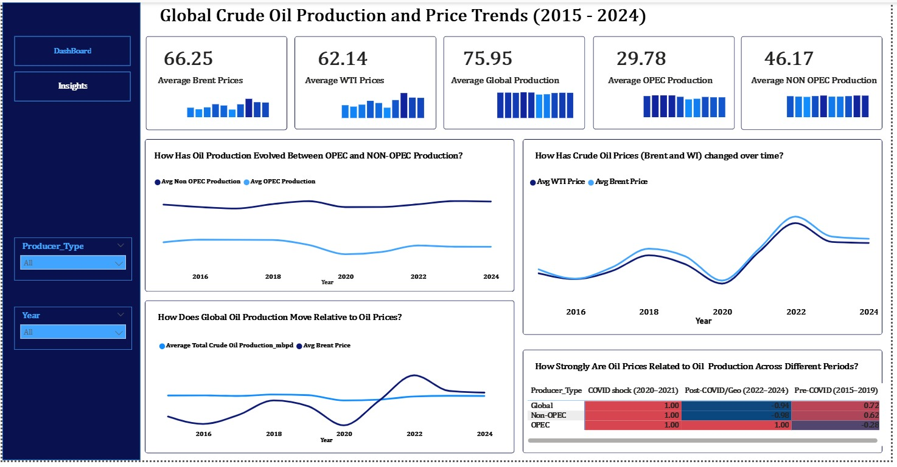

# Global Crude Oil Production and Price Trends (2015–2024)

## 📌 Project Overview

This project analyzes global crude oil production and price trends between 2015 and 2024, focusing on how oil prices (Brent and WTI) interact with production levels across OPEC, Non-OPEC, and global producers.

#### The goal is to uncover:

- Long-term price and production trends
- Differences between OPEC and Non-OPEC production behavior
- How major shocks (e.g., COVID-19) affect oil markets
- The strength of the relationship between production and prices across different periods

#### The final output is an interactive Power BI dashboard supported by a structured data analysis workflow.

## Tools & Technologies

- Python (Pandas, NumPy) – data cleaning & preparation
- Power BI – dashboarding and visualization

## 🎯 Business Questions

##### This analysis answers the following key questions:

1. How have crude oil prices (Brent & WTI) evolved over time?
2. How has oil production differed between OPEC and Non-OPEC producers?
3. How has global crude oil production changed over the last decade?
4. How does global oil production move relative to oil prices?
5. How strong is the relationship between oil prices and production across different periods (Pre-COVID, COVID shock, Post-COVID)?

## 📂 Data Collection

Data was collected from publicly available and reputable energy and economic sources, including:

- **Crude oil prices:** Brent and WTI average annual prices

- **Crude oil production:**
  - Global production (mbpd)
  - OPEC production
  - Non-OPEC production

- Time period: 2015–2024

The dataset was structured at yearly granularity, making it suitable for trend analysis and dashboarding.

## 🧹 Data Cleaning & Preparation

#### Key preparation steps included:

- Standardizing column names for clarity and consistency
- Ensuring all production figures were in million barrels per day (mbpd)
- Handling missing or inconsistent values
- Creating a Period classification:
  - Pre-COVID (2015–2019)
  - COVID shock (2020–2021)
  - Post-COVID / Geopolitical recovery (2022–2024)

The cleaned dataset was then exported for use in Power BI.

[View Full Analysis Here](Day_1/Day_1.ipynb)

## 🔍 Analysis Approach
#### 1. Descriptive Analysis

- Calculated average prices and production values
- Compared OPEC vs Non-OPEC production levels
- Examined year-by-year trends
  
#### 2. Trend Analysis

**Line charts were used to track:**
- Brent vs WTI prices
- OPEC vs Non-OPEC production
- Global production over time

#### 3. Relationship Analysis

- Compared production trends directly against price trends
- Calculated correlation coefficients across different periods to assess how strongly prices and production move together

## 📊 Dashboard Design (Power BI)

#### Key KPIs

- Average Brent Price (66.25)
- Average WTI Price (62.14)
- Average Global Production (75.95)
- Average OPEC Production (29.78)
- Average Non-OPEC Production (46.17)

#### Visuals Included
- Line charts for price and production trends
- Comparative line charts (OPEC vs Non-OPEC)
- Combined production vs price trends
- Correlation matrix to show relationship strength across periods

#### Interactive slicers allow filtering by:
- Year
- Producer type (Global, OPEC, Non-OPEC)

## 💡 Key Insights

#### Price Trends (Brent & WTI)
Crude oil prices move closely together over time, with similar peaks and declines. Prices dropped sharply during the 2020 COVID shock, rebounded strongly in 2022, and eased again in recent years.
OPEC vs Non-OPEC Production
Non-OPEC production remains consistently higher than OPEC production. Both groups experienced a noticeable decline during COVID, followed by gradual recovery afterward.

#### Global Production Trends
Global crude oil production declined significantly during the COVID period but recovered in post-COVID years. However, production growth has been more controlled compared to price volatility.

#### Production vs Price Relationship
Oil prices tend to rise when production is constrained and fall when supply increases. The strongest price movements occurred when production was relatively lower, especially during recovery from COVID.

#### Correlation Across Periods
The relationship between oil prices and production varies by period:

- COVID shock: Very strong correlation
- Pre-COVID & Post-COVID: Weaker correlation, influenced more by geopolitics and demand conditions

## 📈 Overall Finding
Oil prices are more volatile than production. While production adjusts gradually, prices respond sharply to economic shocks, geopolitical events, and supply control decisions. This highlights that oil prices are driven by more than just production volumes.

## Recommendation
Energy policymakers and market participants should not rely solely on production levels to predict oil prices. Strategic decisions should incorporate:

- Economic shocks
- Geopolitical risks
- Coordinated production policies (e.g., OPEC decisions)

These factors have a stronger short-term impact on oil price movements.
